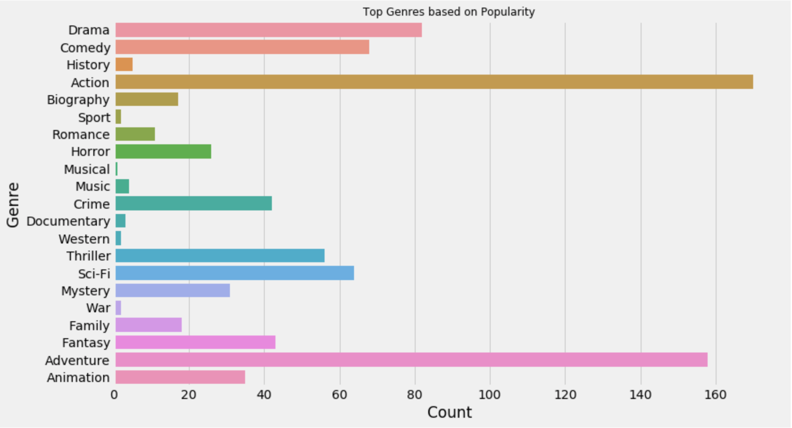
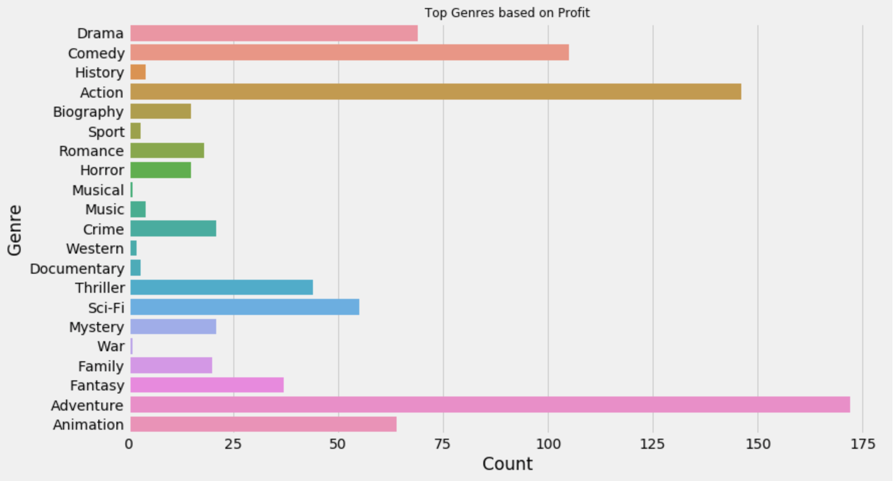
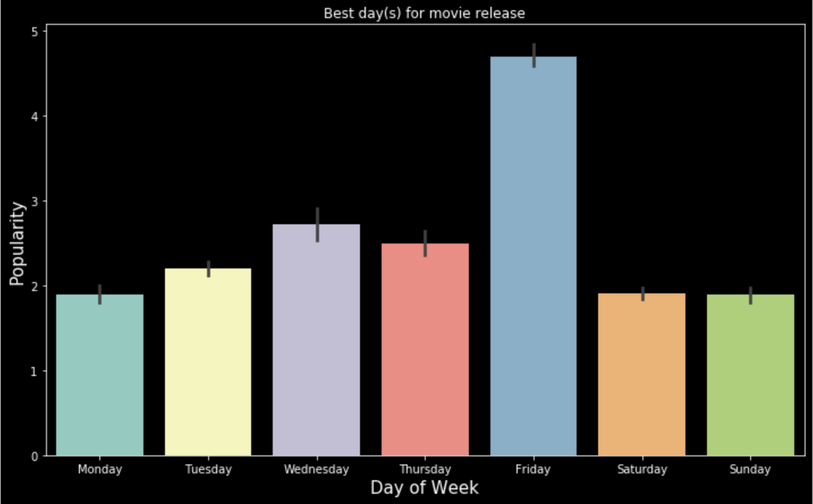
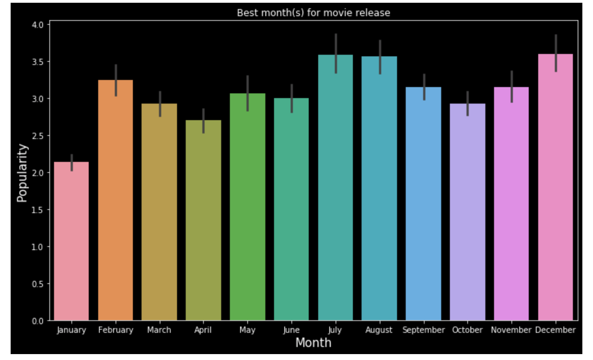
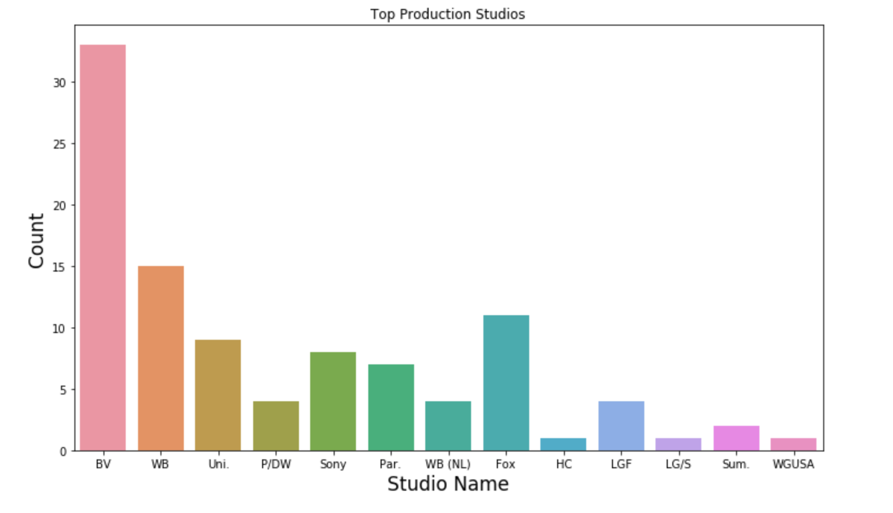
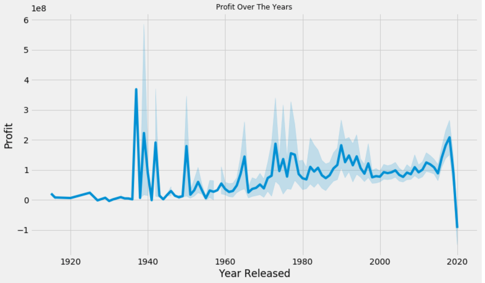
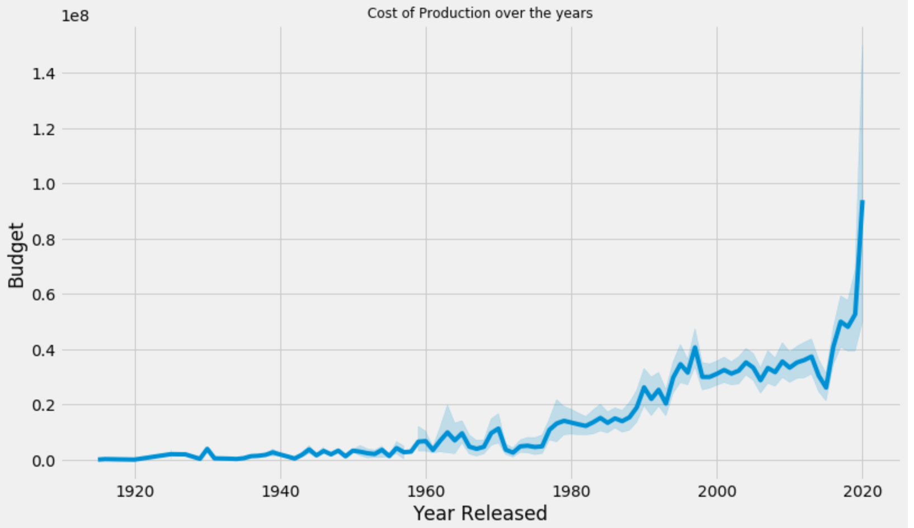
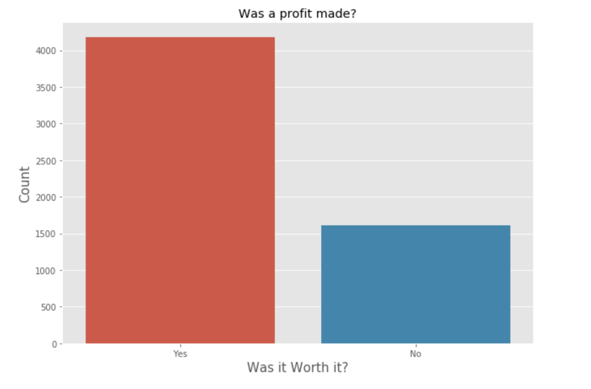

# Module 1 Final Project

## The Project 
Microsoft sees all the big companies creating original video content, and they want to get in on the fun. They have decided to create a new movie studio, but the problem is they don’t know anything about creating movies. They have hired you to help them better understand the movie industry. Your team is charged with doing data analysis and creating a presentation that explores what type of films are currently doing the best at the box office. You must then translate those findings into **_Actionable Insights_** that the CEO can use when deciding what type of films they should be creating.

## The Dataset
For this project, I was provided with multiple datasets:
* Box Office Mojo
* IMDB
* Rotten Tomatoes
* TheMovieDB.org

## Working Files
* Importing_Data.ipynb: In this notebook I worked on importing all the data used in my project.
* Data_Cleaning_and_EDA.ipynb: In this notebook I worked on cleaning my data and preparing it for analysis.
* Budget_Analysis.ipynb & Popularity_Analysis.ipynb: These two notebooks contain rough drafts of my final project.
* Final_Project.ipynb: This notebooks contains all my analysis, findings, and conclusions.

## Insights
The goal of this project is to find information on how Microsoft can dominate the movie industry in other to achieve that we we'll try to answer the following questions with the datas provided.

* Q1: What Genre(s) should Microsoft focus on producing based on Popularity and Profits?
* Q2: What day(s) or months(s) should Microsoft focus on releasing movies?
* Q3: Should Microsoft consider collaborating with other producing studios in other to boost profits?
* Bonus Q1: Is the Movie making Industy still profitable?
* Bonus Q2: What is the average runtime for movies?

## Order of Operation
### Data Importing and Cleaning Process
* Importing_Data.ipynb: As mentioned earlier this notebook contains all my data importing process. the list of libraries used to import and convert data are as follows:
    - **OS**
    - **GLOB**
    - **SQLITE3**
    - **PANDAS**
    - **NUMPY**
    
* Data_Cleaning_and EDA.ipynb: In this notebook I start by converting all SQL tables to Pandas DataFrame and performing the following actions:
    * Checking for _NULL VALUES_ 
    * Looking for _duplicates_
    * _Reindexing_ columns
    * Changing columns to appropriate _Datatypes_
    * Performing _EDA_ by creating new columns to better understand dataset
    
* Budget_Analysis.ipynb & Popularity_Analysis.ipynb: In these notebooks I explore the data further and use it to better understand the questions.

* Final_Project.ipynb: In this notebook we finally get to answering our questions to gain actionable insight on our data. This was made possible with the help of:
    - **MATPLOTLIB**
    - **SEABORN**
    - **PANDAS**

### Further Analysis - Insights
#### Q1: What Genre(s) should Microsoft focus on producing based on Popularity and Profits?

**Insight: Based on the graphs I would strongly advise Microsoft to focus on producing movies with _Action_ and _Adeventure_. Mixing in a little _Comedy_ and _Sci-Fi_ would be greatly benefitial aswell.**

#### Q2: What day(s) or months(s) should Microsoft focus on releasing movies?

**Insight: Based on the first graph I would recommend releasing movies on _Fridays_. The release month does not seem to have much of an impact on the popularity of the movies.**

#### Q3: Should Microsoft consider collaborating with other producing studios in other to boost profits?

**Insight: My recommendation based on this graph would be for Microsoft to consider collaborating with other Studios to boost profits.**

#### Bonus Q1: Is the Movie making Industy still profitable?

**Insight: Based on the first graph it seems the profit earned from producing movies seems to increase gradually but not as drastically as you would expect. On the other had it's clear that the amount spent on producing movies have increased drastically over the last half-century.**

#### Bonus Q2: What is the average runtime for movies?

**Insight: From my previous graph analyzing the profit made on movies over the years, it doesn't seem like there is a significant profit being made but with a closer look at this graph we can tell that there is still profit to be made overall.**

### Summary
With all the information I've gathered there seems to be a lot a pros and cons to investing in the movie industry but overall it would not be a bad idea to move forward with plans for producing movies.

### Recommendation
If Microsoft does decide to go into the Film Industry I would suggest further analysis be conducted on TV Shows and compared with the Movie margins.

